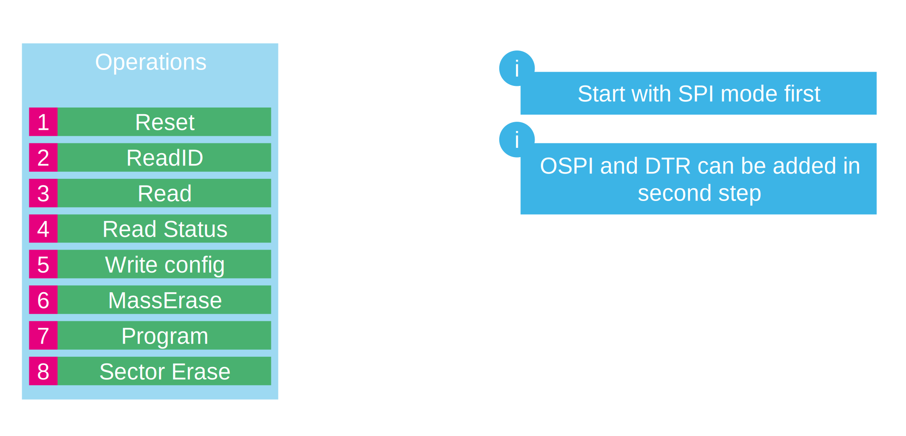

# Introduction

In this handson we will crete same application as in
[stm32h7rs_ospi](https://github.com/ST-TOMAS-Examples-ExtMem/stm32h7rs_ospi)

How ever now we consider that our external memory dont have possiblity to support the SFDP protocol. As result we need to create the driver ourselfs. 
for this we will use some part of the EXTMEM Manager but the soutines for handling the memory need to be created by us. 

> [!Important]
> The emories can be different. This part is related to the emomry on the Nucleo kit. Im trying to describe the usual way how the memories work. However they can still > differ. And you need to send more commands or handle the memory differently. This will be described in memory datasheet. 

# Which functions to implement

We will use the user file which highliting the functions needed. 
First we will do it only in bootloader because we can test it directly. 

Best is start with thise functions

## 1. Reset

This will put the memory to default state. Important in case you are using Octo/Quad/Dual mode and you was stopped in the middle of configuration this will ensure the memory is in default state. 

>[!WARNING]
> In case of Octo/Quad/Dual mode you must send the Reset for this modes too. 
> Example: Octo mode SDR - Reset for Octo mode > Then for sure Reset in normal mode
> Example: Octo mode DTR - Reset Octo DTR mode > Reset Octo mode > Then for sure Reset in normal mode

## 2. ReadID

Our firt read test this will ensure memory is correctly connected. The ID is known value described in memory DS so we know what to read. 
This can help solve issue in memory connection on wrong xSPI speed. 

## 3. Read

We will switch xSPI to memory mapped mode and setup it to read from memory. In case you used [stm32h7rs_osp](https://github.com/ST-TOMAS-Examples-ExtMem/stm32h7rs_osp) handson you can directly compare data. If not you will read most probalby only `0xFF`

## 4. Read Status

We will read status of memory. 
Need for programing. Mainly a programming in progress. And memory unlocked status. 

## 5. Write Config

Here we will mainly unlock the memory. 
ptionally the write config can be used to set memory to OSPI or DTR mode. 

## 6. MassErase

Simples of programming commands. 
We can cal it and check with read if the emory was erased. 

## 7. Program

Finaly we can program relevant data.

## 8. Sector erase

Last operation we direclty erase sectors. It si faster than MassErase. 

# [Start with CubeMX](2_extmem_user_mx.md)
