# STM32CubeMX 

## Project startup

### 1. Run STM32CubeMX
### 2. Menu>File>New Project...

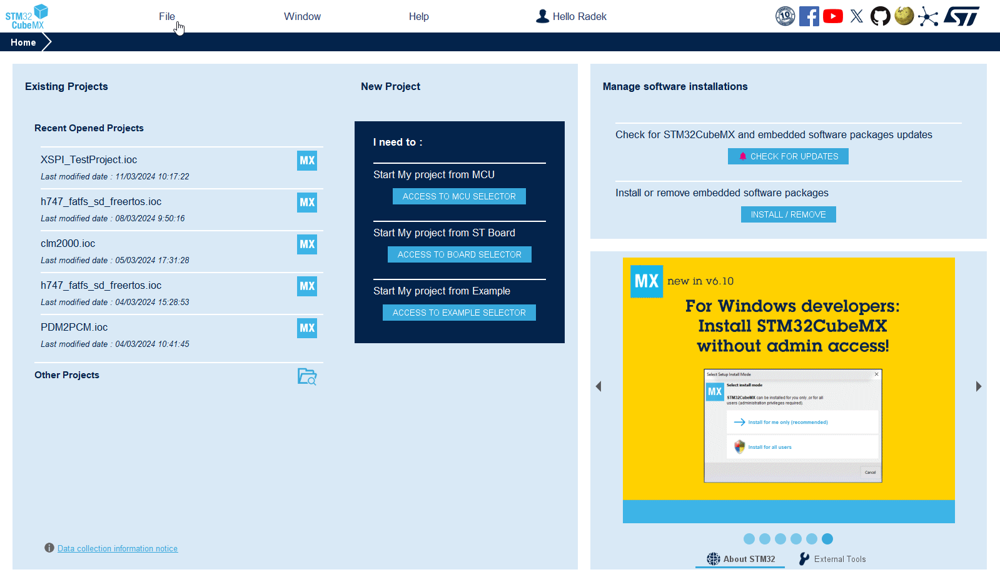

### 3. Search for STM32H7S3L8H6 (same as on NUCLEO-H7S3L8)

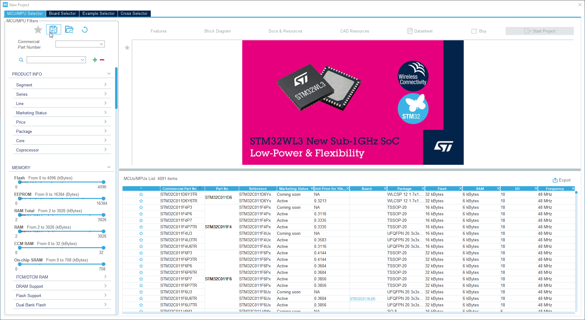

### 4. Start a new project 

### 5. Respond to the pop-up by agreeing to apply the default configuration for the Memory Protection Unit (MPU)

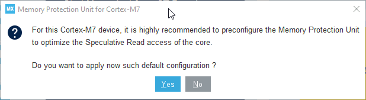


# Pinout

We start with LED

1. The LED is connected to PD13; configure it as an output. 

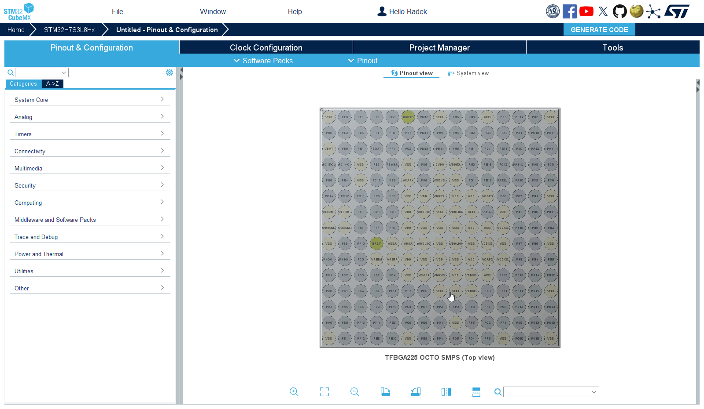

2. (For MX 6.12)Right-click on the pin and select Pin Reservation -> Application
  
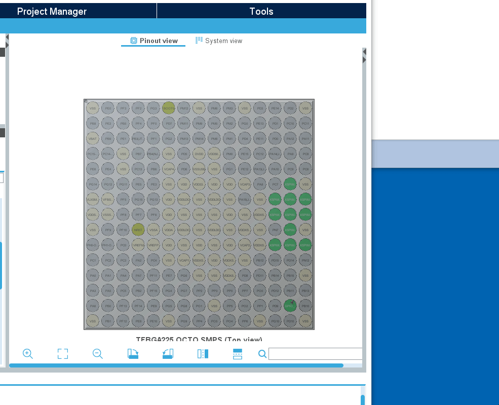

2. For new MX open `GPIO` select pin `PD13` and set **Pin Context Assinment** to `APPLICATION`

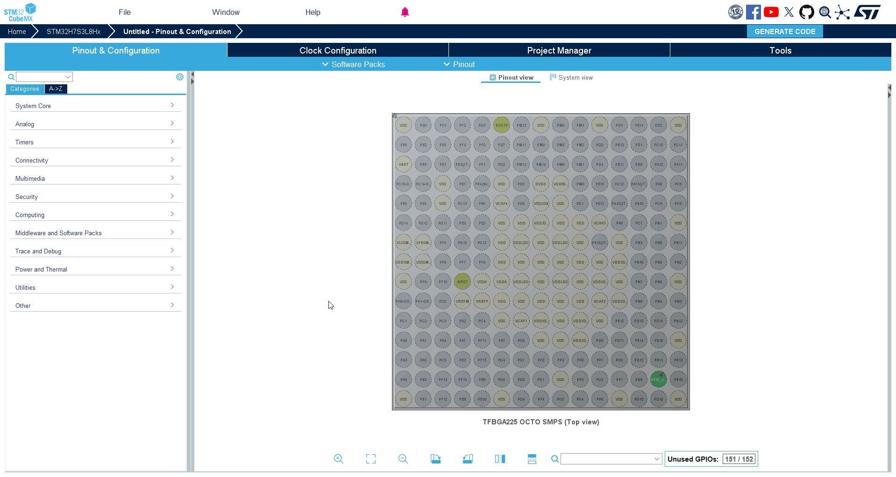


Pin reservation allows you to specify which application has access to use the pin.

# PWR configuration

1. Select RCC
2. Set Supply Source to PWR_LDO_SUPPLY (the NUCLEO-H7S3L8 board features an LDO and does not include an SMPS)

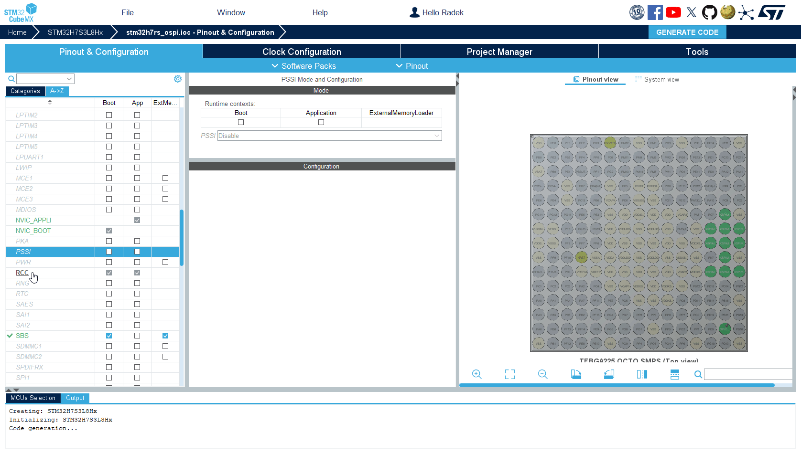

# MPU confguration

[MPU info](../theory/mpu.md)

By default, the MPU disables access to external memory, so we need to enable it.

Confiogure MPU in `CORTEX_M7_BOOT` 
We'll be able to access the OSPI memory region, allowing code to be executed from there and utilizing the core cache.

1. Open `CORTEX_M7_BOOT`
2. Region 1 `enable`
3. Region base address `0x90000000`

```c
0x90000000
```

4. Region size `32MB`
5. Access permission to `ALL ACCESS PERMITTED`
6. Instruction access `ENABLE`
7. Cacheable `ENABLE`
8. Bufferable `ENABLE`

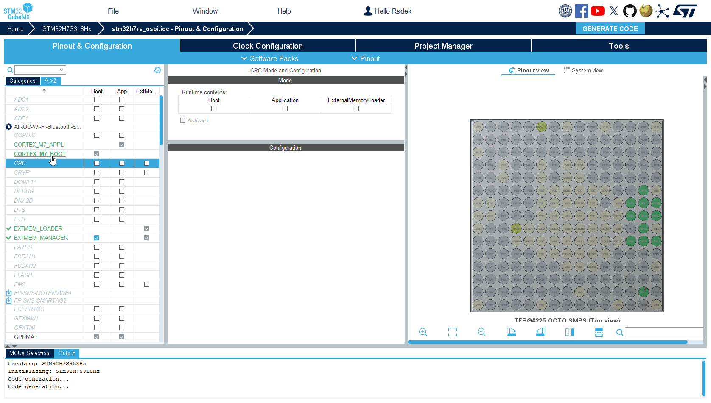

In `CORTEX_M7_APPLI` we will disable MPU config this will use config from `CORTEX_M7_BOOT`

9. Open `CORTEX_M7_APPLI`
10. Set **MPU Control Mode** to` MPU NOT USED`


# XSPI Mode

We will utilize the XSPI1 (Extended-SPI interface for connecting with external serial memory devices)

xSPI1 is connectd to port1 and port2 on Nucleo the memoryis on port2

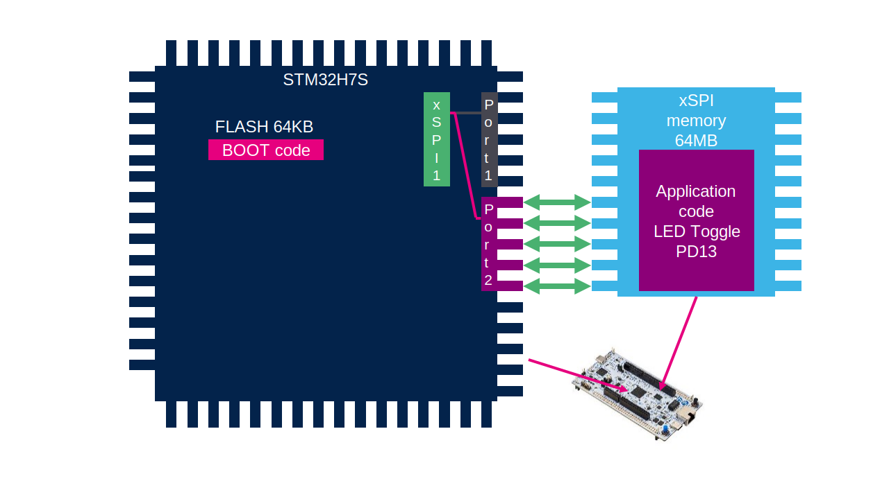

1. Select XSPI1 configuration for `Bootloader` and for `External loader`
   
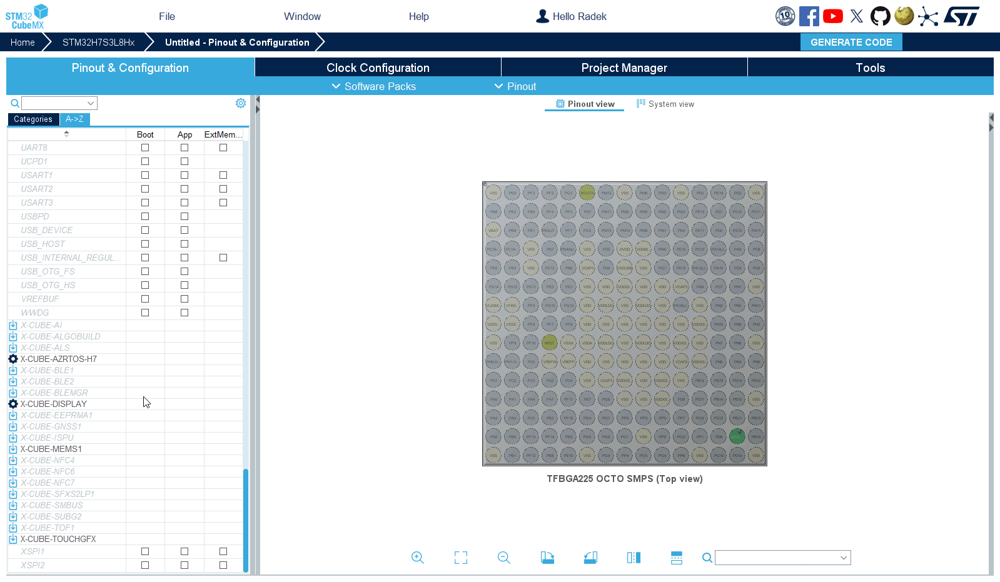

2. Select XSPI1
3. Select Mode to `Octo SPI`
4. Select port to `Port 2 Octo`
5. Select Chip select override to `NCS1 - Port 2`

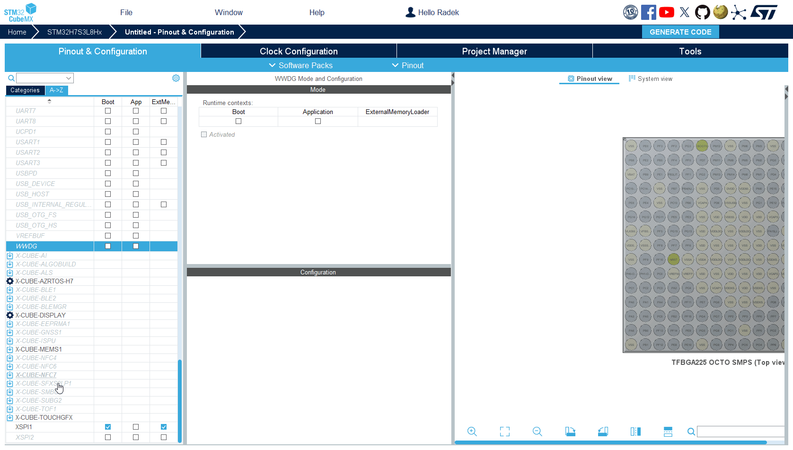

# XSPI configration

1. Select Memory type to `Macronix` (memory on the NUCLEO-H7S3L8 board) 
2. Memory size to `32 MBytes` or `256Mbits`
3. Chip Select High Time Cycle to `2`
4. Set Sample shifting `Half Cycle`

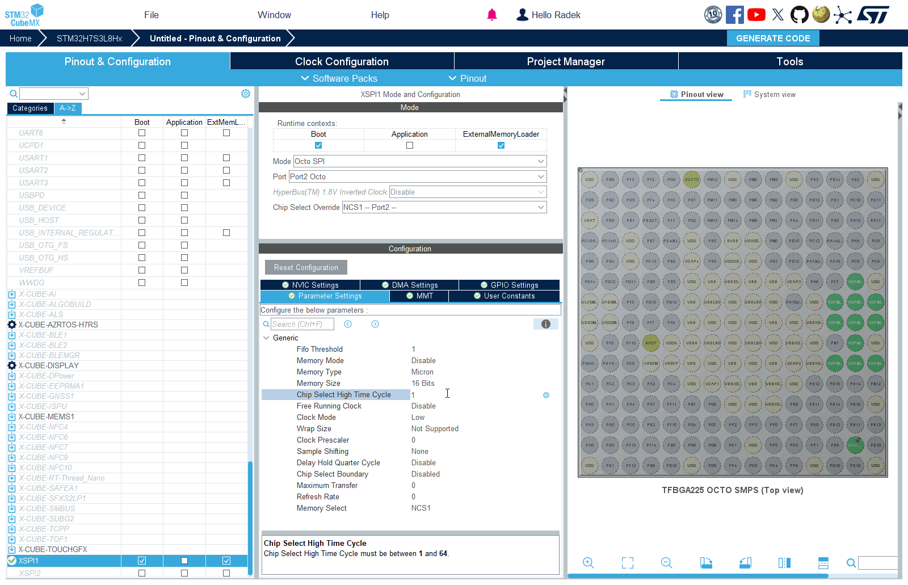

# SBS configruation

1. Select SBS for `Bootloader` and `External Loader`
2. Select the SBS peripheral
3. Activate SBS
4. Set IO HSLV for XSPIM2 to `ENABLE`


The `IO HSLV for XSPIM2` is chosen because Port 2 is utilized for XSPI1.

# EXTMEM_MANAGER - External Memory manager

!!!!

It's a middleware that can automatically configure the external serial memory interface (xSPI), provided that the memory supports the SFDP standard (Serial Flash Discoverable Parameters defined by JEDEC), or is connected to SDMMC.
Utilizing SFDP-compliant memory allows the STM32 MCU to automatically detect and set up memory parameters, which ensures compatibility and simplifies integration process.

1. Select the EXTMEM_MANAGER middleware for `Bootloader` and External Loader(enabled by default)
2. Check `Activate External Memory Manager`

<!-- 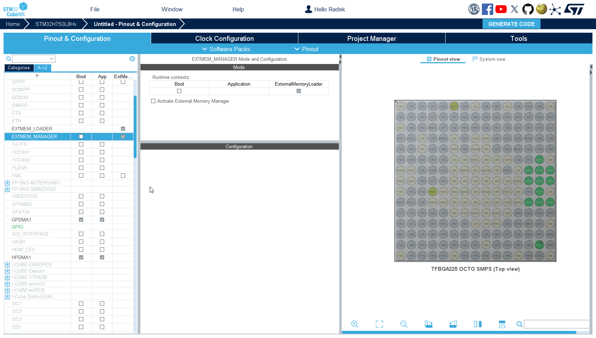 -->

3. Go to Boot usecase tab
4. Check `select boot code generation`

<!-- 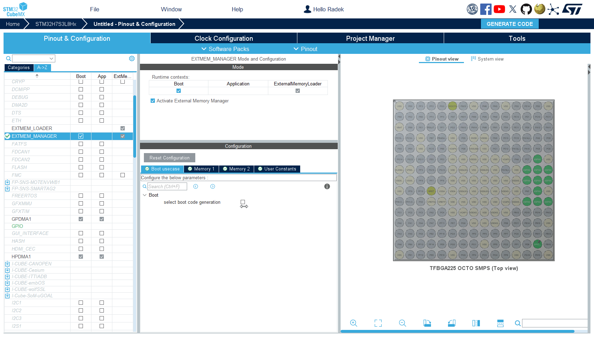 -->


We keep the Execute in Place option, which means the code will be executed directly from external memory. 
The alternative option, 'Load and Run,' means that the code will be transferred from external memory into RAM (either internal SRAM or another external memory) for execution.
Memory is `Memory 1 `

5. Go to Memory 1 tab
6. Select the memory driver to `EXTMEM_USER`


This optim will create a blak interface for use where we can implement any memory we want to interface

# EXTMEM_LOADER

<!-- [External Loader info](../theory/extmem_loader.md) -->

1. Select the EXTMEM_LOADER middleware
2. Check Activate External Memory Loader

<!-- 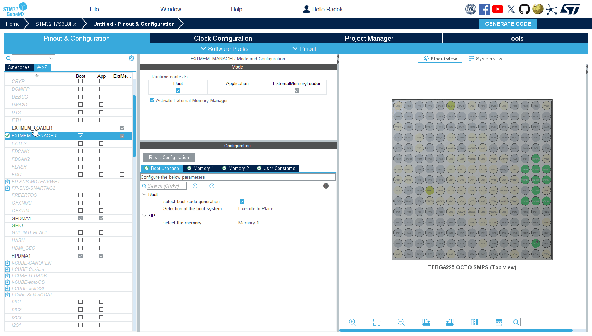 -->

3. Select `External Memory Loader` tab
4. Set number of sector to `8192`
5. Set Sector size to `4096`

All these parameters are taken from the memory datasheet.

You can rename the `loader name` for easier recognition if necessary. 
Additionally, the `programmming/erase time` can be further optimized according to the specifications in the memory datasheet."

 

<!-- 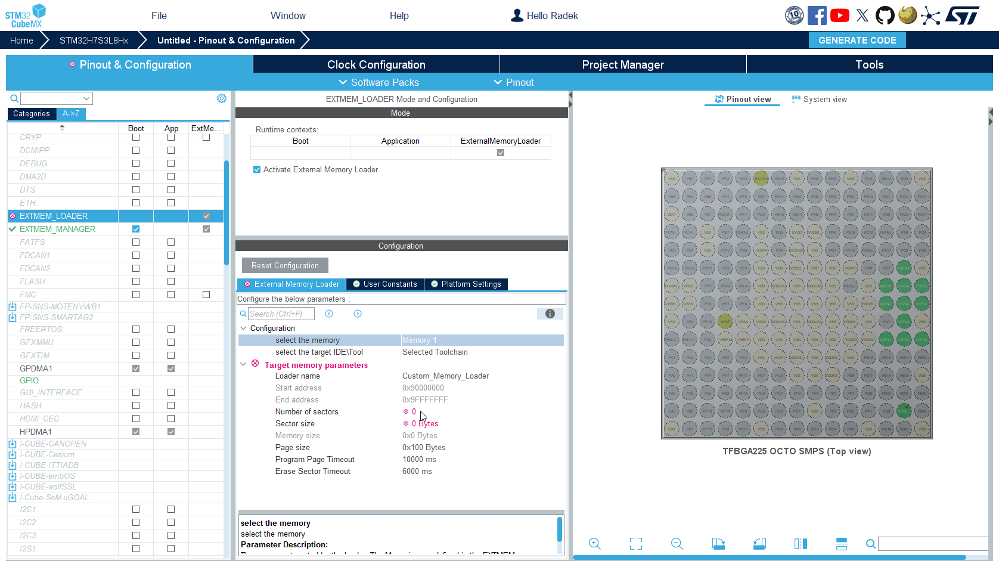 -->

# Clock Configuration

1. Go to `Clock Configuration` tab
2. Set **CPUCLK** to `600MHz`


1. Set **XSPI** clock to 200 MHz
   1. Set **XSPI1** Clock mux to `PLL2S`
   2. Set **DIVM2** to `/4`
   3. set **DIVN2** to `50`
   4. Set **DIVS2** to `/4`

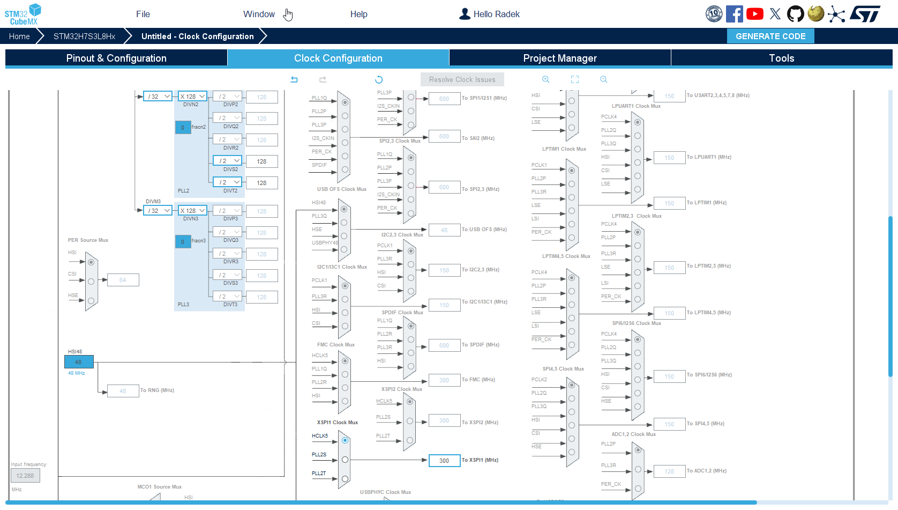

On the STM32H7R/S, the XSPI (the interface for connecting with external serial memory devices) is capable of operating at speeds of up to 200 MHz in DTR (Double Transfer Rate) mode.

# Project Manager

1. Navigate to the `Project Manager` tab
2. Choose a name for your project and select its location 
3. select `ExtMemLoader Project`
4. Select STM32CubeIDE as the Toolchain
5. Generate Project

